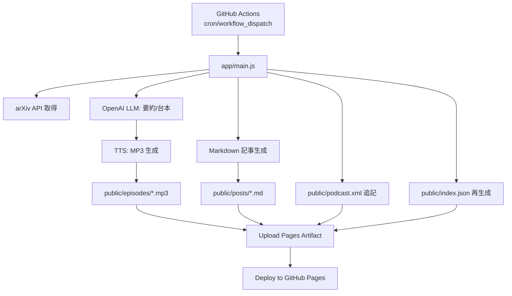

# ArxivCaster — arXiv を毎日ポッドキャスト配信する

「最新の研究を、毎日の習慣に。」arXiv の新着から注目論文を取得し、要約 → 台本化 → 音声合成 → 記事化 → RSS 更新 → GitHub Pages で公開までを自動化します。生成物はすべてこのリポジトリ内で完結し、Pages のみでホスティングできます。

> 1日1本、JST 23:00 に自動更新。Spotify などの Podcast アプリにも RSS 経由で反映されます。

---

## 特徴 ✨
- LangChain なしの軽量オーケストレーション（Node.js）
- arXiv → 要約（日本語）→ Podcast 台本 → TTS(MP3) → Markdown 記事 → RSS 2.0 を一気通貫
- GitHub Actions だけで毎日自動実行（cron: `0 14 * * *` = JST 23:00）
- GitHub Pages アーティファクト配信。外部リポジトリや別ブランチへのコミット不要
- おしゃれなノイズ背景のフロント（`public/index.html` / `public/viewer.html`）

---

## 生成物 📦
- `public/episodes/YYYYMMDD-<arxivId>.mp3` — 音声エピソード
- `public/posts/YYYYMMDD-<arxivId>.md` — 記事（要約 + 台本全文 + audio 埋め込み）
- `public/podcast.xml` — RSS フィード（毎回 `<item>` を追記）
- `public/index.json` — サイト用の投稿一覧（自動再生成）
- `public/cover.png` — Podcast のカバー画像（Spotify 等で使用）

---

## 全体像 🗺️


---

## ディレクトリ構成 🧭
```
app/
  arxiv.js      # arXiv API クエリ/正規化
  llm.js        # 要約/台本/TTS（OpenAI）
  rss.js        # RSS 初期化と <item> 追加
  utils.js      # 共通ユーティリティ
  main.js       # パイプライン本体
public/
  index.html    # 一覧（ノイズ背景のカードUI）
  viewer.html   # 記事ビューア（クライアントでMD→HTML）
  podcast.xml   # RSS フィード
  posts/        # 生成された記事 .md
  episodes/     # 生成された MP3
.github/workflows/
  publish.yml   # Pages 用ビルド/デプロイ（毎日実行）
```

---

## クイックスタート 🚀
1) 依存インストール（Node.js 20+）
```
npm i
```

2) 環境変数を設定（ローカル実行の場合）
```
cp .env.example .env
# .env を編集して OPENAI_API_KEY や SITE_BASE_URL を設定
```

3) 一度実行（ローカル）
```
npm start
# 生成物: public/episodes/*.mp3, public/posts/*.md, public/podcast.xml, public/index.json
```

4) GitHub Pages で公開
- リポジトリ Settings → Pages → Build and deployment → “GitHub Actions” を選択
- リポジトリ Secrets に登録
  - `OPENAI_API_KEY`（必須）
  - `ARXIV_QUERY`（例: `cat:cs.LG`）
  - `ARXIV_MAX`（任意・既定1）
  - `SITE_BASE_URL`（任意・未設定時は `https://<owner>.github.io/<repo>` を自動推定）
- Actions タブから `Pages` ワークフローを `Run workflow` で手動実行
- 完了後、`deploy` ジョブの `page_url` が公開URLになります

---

## 環境変数 🔧
- `OPENAI_API_KEY`（必須）: OpenAI APIキー
- `ARXIV_QUERY`: arXiv 検索クエリ（例: `cat:cs.LG`）
  - `||` 区切りで複数クエリに対応（それぞれ取得→重複除外→新しい順に結合）
  - まずは簡単に拾いたい: `cat:cs.AI`
  - 少し広く: `(cat:cs.AI OR cat:cs.LG OR cat:cs.CL)`
  - キーワードを少し足す: `(cat:cs.AI OR cat:cs.LG) AND (all:agent OR ti:agent OR abs:agent)`
  - 複数に分けて集約: `cat:cs.AI || cat:cs.LG || cat:cs.CL`
- `ARXIV_MAX`: 一度に取得する最大件数（既定 1）
- `ARXIV_POOL_SIZE`: ランダム選択用の取得プールサイズ（既定 200）
- `ARXIV_RANDOM_MODE`: ランダムの種類（`daily` = 日替りで決まる固定乱数, `true_random` = 実行毎に変化）
- `DEDUP_HISTORY`: 既掲載の論文IDを除外（既定 `true`）
- `HISTORY_WINDOW_DAYS`: 除外対象とする履歴の期間（日数、既定 `0`=全期間）
- `SITE_BASE_URL`: サイトのベースURL（RSSの`enclosure`/記事内リンクで使用）
- `OPENAI_LLM_MODEL`: LLM モデル（既定 `gpt-4o-mini`）
- `OPENAI_TTS_MODEL`: TTS モデル（既定 `gpt-4o-mini-tts`）
- `OPENAI_TTS_VOICE`: TTS ボイス（既定 `alloy`）
- `PODCAST_TITLE` / `PODCAST_DESCRIPTION` / `PODCAST_AUTHOR` / `PODCAST_IMAGE_URL`: Podcast の各種メタ（iTunes拡張タグに反映）
- `PODCAST_OWNER_NAME` / `PODCAST_OWNER_EMAIL`: 所有者情報（Spotifyの所有者確認に利用）。メールは有効な受信可能アドレスを設定。
- `PODCAST_CATEGORY` / `PODCAST_SUBCATEGORY`: iTunes/Spotify のカテゴリ（プライマリは必須）。例: `Technology` / `Software How-To`。
- `QIITA_PUBLISH` / `QIITA_ACCESS_TOKEN` / `QIITA_TAGS` / `QIITA_PRIVATE` / `QIITA_TITLE_PREFIX`: Qiita 投稿制御

`.env` を使う場合は `app/main.js` が `dotenv/config` を読み込むため、ファイルを置くだけでOKです。

---

## 運用ルール 🧪
- 記事と台本には「論文タイトル・著者・arXivリンク」を必ず含めます
- 著作権配慮: 論文本体や図は転載せず、要約とリンクで紹介します
- 品質ゲート: 要約には必ず「限界 / 今後の展望」を含めます
- 冪等性: スラッグは `YYYYMMDD-<arxivId>` 形式。既に同スラッグが存在する場合はスキップ（同日に複数本の配信が可能）

---

## よくあるエラーと対処 🩺
- `OpenAIError: OPENAI_API_KEY ... missing or empty`
  - `.env` に `OPENAI_API_KEY` を設定、もしくは Actions の Secrets に登録してください
  - 本リポジトリでは OpenAI クライアントを遅延初期化していますが、キー未設定では実行できません
- 音声が再生できない / リンクが相対になる
  - `SITE_BASE_URL` を GitHub Pages のURLで設定してください（プロジェクトページ配下でも可）
- RSS を Podcast に登録できない
  - `public/podcast.xml` の `<enclosure url>` が有効な絶対URLか確認してください（`SITE_BASE_URL` 設定が近道）

---

## Spotify への自動配信 🎧
- 初回のみ、Spotify for Podcasters に RSS を登録（例: `https://<owner>.github.io/<repo>/podcast.xml`）。以降はRSS更新で自動反映。
- 推奨設定（Secrets または `.env`）
  - `PODCAST_TITLE`, `PODCAST_DESCRIPTION`, `PODCAST_AUTHOR`
  - `PODCAST_IMAGE_URL`（未設定時は `SITE_BASE_URL/cover.png` を使用）
  - `PODCAST_OWNER_NAME`, `PODCAST_OWNER_EMAIL`（所有者確認用）
- カバー画像: `public/cover.png`（1400–3000px 四方、PNG/JPG、RGB）
- 注意: Spotify/iTunesタグ（author/summary/image/owner/explicit）は `podcast.xml` に自動出力されます。
- 技術要件: `<enclosure>` は `length` 属性（バイト数）が必須。本実装では生成MP3のバイト長を自動付与。GitHub Pages は HEAD/Range に対応しているためストリーミング要件も満たします。
 - アートワーク要件（重要）: 3000×3000px 推奨（最低1400×1400）、JPG/PNG、RGB、72dpi。`PODCAST_IMAGE_URL` でURL指定（デフォルトは `SITE_BASE_URL/cover.png`）。

---

## Qiita へ毎回自動投稿 ✍️
- 事前準備: Qiita アクセストークンを取得（Settings → Applications）
- リポジトリ Secrets に登録:
  - `QIITA_ACCESS_TOKEN`
  - `QIITA_PUBLISH=true`（手動実行の入力でも可）
  - 任意: `QIITA_TAGS`（例: `arxiv,podcast,ml`）, `QIITA_PRIVATE`, `QIITA_TITLE_PREFIX`
- 動作: パイプラインが `public/posts/YYYYMMDD.md` を生成後、その内容を本文として `POST /api/v2/items` に投稿します。タイトルは `[ArxivCaster] {論文タイトル}` 形式（接頭辞は変更可）。
- 重複回避: 同日スラッグのidempotencyは維持。`FORCE_RUN=true` で再実行した場合はQiitaにも再投稿される点に注意。

---

## カスタマイズ 🧩
- モデル変更: `.env` で `OPENAI_LLM_MODEL` / `OPENAI_TTS_MODEL` / `OPENAI_TTS_VOICE`
- 対象カテゴリ変更: `.env` の `ARXIV_QUERY` を好みに調整
- サイト見た目: `public/index.html` / `public/viewer.html` の CSS・ノイズ背景関数を編集
- 出力テンプレ: `app/main.js` の `renderPostMarkdown` を編集（フロントマター/見出しなど）
- データ拡充: `public/index.json` に追加メタデータを出力し、フロントで表示

---

## 開発メモ 🛠
- ローカル検証: `npm start`（`ARXIV_QUERY` を短く、`ARXIV_POOL_SIZE=50` など）
- 単発試行: `npm run run:once`（環境変数で上書き可能）
- 大量実行は避け、API利用ポリシーに留意してください

---

## ロードマップ 🧭
- スコアリングで注目度の高い論文を優先
- 日本語/英語の二言語記事生成
- サムネイル画像の自動生成と埋め込み
- Qiita / Zenn へのクロスポスト
- LangGraph 化（ノード分割・リトライ・ログ強化）

---

## 謝辞 🙌
- arXiv API / OpenAI API に感謝します
- 本リポジトリは「このリポジトリだけで完結して Pages 配信」できるよう設計されています

> 質問・要望は Issue へどうぞ。改良のアイデアお待ちしています！
